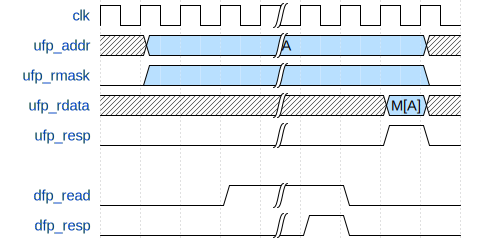
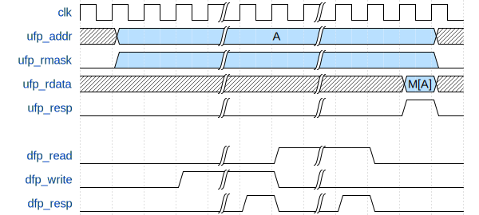
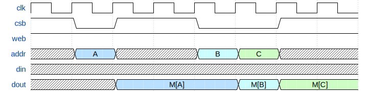
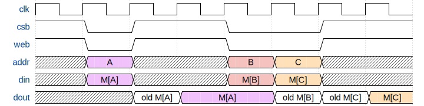
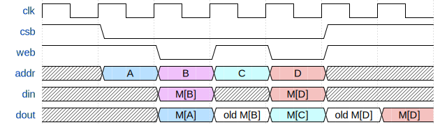

# ECE 411: mp_cache README

## Multicycle 4-Way Set-Associative Cache

> The software programs described in this document are confidential
> and proprietary products of Synopsys Corp. or its licensors. The
> terms and conditions governing the sale and licensing of Synopsys
> products are set forth in written agreements between Synopsys Corp.
> and its customers. No representation or other affirmation of fact
> contained in this publication shall be deemed to be a warranty or
> give rise to any liability of Synopsys Corp. whatsoever. Images of
> software programs in use are assumed to be copyright and may not be
> reproduced.
> 
> This document is for informational and instructional purposes only.
> The ECE 411 teaching staff reserves the right to make changes in
> specifications and other information contained in this publication
> without prior notice, and the reader should, in all cases, consult
> the teaching staff to determine whether any changes have been made.

---

**This document, README.md, forms the specification for the machine
problem. For a more comprehensive summary, see [GUIDE.md](./GUIDE.md).**


## Design Specifications

The goal of this machine problem is to design and verify a **4-way,
set-associative cache** with the following specifications:
- 16 sets
- 4 ways per set
- 32 byte cachelines
- Write-back with a write allocate policy
- Pseudo-LRU replacement policy: from lecture (Tree-PLRU)
- Indexing scheme:

<p align="center">
  
  <p align="center">Indexing scheme</p>
</p>

For the pseudo-LRU policy, do not give invalid cachelines priority over
whichever cacheline the PLRU logic dictates you use. That is, the
  cache must always use PLRU to decide which way to populate/invalidate.


## Cache Interface Description

``` systemverilog
    input   logic           clk,
    input   logic           rst,

    // cpu side signals, ufp -> upward facing port
    input   logic   [31:0]  ufp_addr,
    input   logic   [3:0]   ufp_rmask,
    input   logic   [3:0]   ufp_wmask,
    output  logic   [31:0]  ufp_rdata,
    input   logic   [31:0]  ufp_wdata,
    output  logic           ufp_resp,

    // memory side signals, dfp -> downward facing port
    output  logic   [31:0]  dfp_addr,
    output  logic           dfp_read,
    output  logic           dfp_write,
    input   logic   [255:0] dfp_rdata,
    output  logic   [255:0] dfp_wdata,
    input   logic           dfp_resp

```


For UFP (upward facing port), the mask signals work in the following
manner:
- `ufp_wmask` tells the cache which bytes out of the 4 bytes in
  `ufp_wdata` are to be written. A nonzero `ufp_wmask` indicates a
  write request.
- `ufp_rmask` specifies which bytes of `ufp_rdata` the UFP will use.
  You may return any byte at a position whose corresponding bit in
  `ufp_rmask` is zero. A nonzero `ufp_rmask` indicates a read request.
- `ufp_addr[1:0]` will always be `'0`, that is, all accesses to the
  cache on UFP are 32-bit aligned.

For DFP (downward facing port) that interfaces with a physical memory
model:
- `dfp_addr[4:0]` should always be `'0`, that is, all accesses to
  physical memory must be 256-bit aligned.

## Cache Timing Requirements

The cache must obey the following timing requirements, on both UFP
(upward facing port) and DFP (downward facing port).

### Hits

<p align="center">  <p
  align="center">Read hit timing diagram</p> </p>

<p align="center">  <p
  align="center">Write hit timing diagram</p> </p>

### Clean Misses

<p align="center">  <p
  align="center">Read clean miss timing diagram</p> </p>

<p align="center">  <p
  align="center">Write clean miss timing diagram</p> </p>


### Dirty Misses

<p align="center">  <p
  align="center">Read dirty miss timing diagram</p> </p>

<p align="center">  <p
  align="center">Write dirty miss timing diagram</p> </p>


## DFP Memory Behavior

The physical memory that your cache interfaces with has the following
behavior:

<p align="center">  <p
  align="center">Read from physical memory</p> </p>

<p align="center">  <p
  align="center">Write to physical memory</p> </p>

## SRAM Behavior

[OpenRAM](https://openram.org/) must be used for the data and tag
arrays. After following the steps listed in GUIDE.md, SRAM files can be
found in `sram/outputs/*`. Sample instantiations of these SRAMs are
provided in `hdl/cache.sv`. All other arrays must be implemented using D
flip-flops. OpenRAM provides SRAM models with the following behavior:


<p align="center">  <p
  align="center">Read from SRAM</p> </p>


<p align="center">  <p
  align="center">Write to SRAM</p> </p>


<p align="center">  <p
  align="center">Mixed reads and writes to SRAM</p> </p>


<p align="center">  <p
  align="center">Reading and writing to same address for SRAM</p> </p>


## Grading

### Submission
You will be graded on the `main` branch of your class GitHub
repository at the specified deadline.

Files you will be graded on:
- `hdl/*.sv`
- `pkg/types.sv`

All other files will be replaced by the autograder. Note that files in
`hdl/*` and `pkg/*` must not contain calls to non-synthesizable SystemVerilog
system tasks (such as `$display`). Note that the autograder simply
string-matches for these, so calls to these tasks may not exist in
comments either (i.e., `/* $display("ece411"); */` will also cause a
failure).

### Checkpoints
This MP will be split into 2 checkpoints:
- **CP1**: You are expected to have read hits and read misses working
  with correct timing and the PLRU replacement policy. The only
  requirement you do not have to meet at this checkpoint is having
  UFP writes working.
- **CP2**: You are expected to have a fully functional cache that
  supports both reads and writes.

### Points

| Checkpoint | Points |
|------------|--------|
| CP1        | 25     |
| CP2        | 75     |

If your design contains any warnings from lint/compile/synthesis, your
final score will be multiplied by 0.9.

**Failure to satisfy any of these requirements will result in a 0 on
the entire MP:**
- Area <= 50,000 μm<sup>2</sup>
- Clock frequency >= 500 MHz
