# ECE 411: mp_cache README

## Pipelined 4-Way Set-Associative Cache

**This document, README.md, forms the specification for the machine
problem. For a more comprehensive summary, see [GUIDE.md](./GUIDE.md).**

# Design Specifications

The goal of this machine problem is to design and verify a **pipelined,
4-way, set-associative cache** with the following specifications:
- 2-stage pipelined (more on this later):
  - 1 cycle latency in response on cache hits
  - 1 read access per cycle throughput on cache hits
  - 0.5 write access per cycle throughput on cache hits
- 16 sets
- 4 ways per set
- 32 byte cachelines
- Write-back with a write allocate policy
- Pseudo-LRU replacement policy from lecture (Tree-PLRU)
- Indexing scheme:

<p align="center">
  
  <p align="center">Indexing scheme</p>
</p>

For the pseudo-LRU policy, do not give invalid cachelines priority over
whichever cacheline the PLRU logic indicates. That is, the
cache must always use PLRU to decide which way to populate/invalidate.

# Cache Interface Description

``` systemverilog
    input   logic           clk,
    input   logic           rst,

    // cpu side signals, ufp -> upward facing port
    input   logic   [31:0]  ufp_addr,
    input   logic   [3:0]   ufp_rmask,
    input   logic   [3:0]   ufp_wmask,
    output  logic   [31:0]  ufp_rdata,
    input   logic   [31:0]  ufp_wdata,
    output  logic           ufp_resp,

    // memory side signals, dfp -> downward facing port
    output  logic   [31:0]  dfp_addr,
    output  logic           dfp_read,
    output  logic           dfp_write,
    input   logic   [255:0] dfp_rdata,
    output  logic   [255:0] dfp_wdata,
    input   logic           dfp_resp

```

For UFP (upward facing port), the mask signals work in the following
manner:
- `ufp_wmask` tells the cache which bytes out of the 4 bytes in
  `ufp_wdata` are to be written. A nonzero `ufp_wmask` indicates a
  write request.
- `ufp_rmask` specifies which bytes of `ufp_rdata` the UFP will use.
  You may return any byte at a position whose corresponding bit in
  `ufp_rmask` is zero. A nonzero `ufp_rmask` indicates a read request.
- `ufp_addr[1:0]` will always be `'0`, that is, all accesses to the
  cache on UFP are 32-bit aligned.

For DFP (downward facing port) that interfaces with a physical memory
model:
- `dfp_addr[4:0]` should always be `'0`, that is, all accesses to
  physical memory must be 256-bit aligned.

# Cache Timing Requirements

The cache must obey the following timing requirements:

## Hits

<p align="center"> 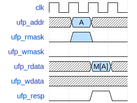 <p
  align="center">Single Read hit timing diagram</p> </p>

<p align="center"> 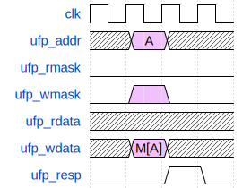 <p
  align="center">Single Write hit timing diagram</p> </p>

<p align="center"> 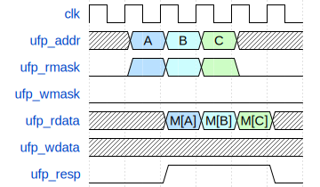 <p
  align="center">Consecutive Read hit timing diagram</p> </p>

<p align="center"> 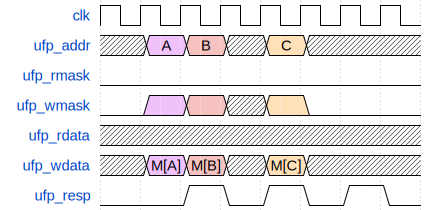 <p
  align="center">Consecutive Write hit timing diagram</p> </p>

## Clean Misses

<p align="center"> 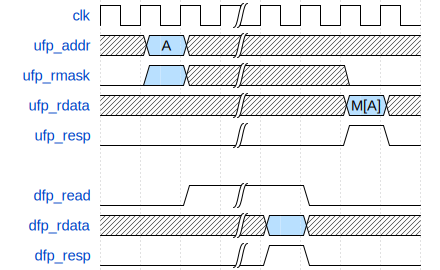 <p
  align="center">Single Read with clean miss timing diagram</p> </p>

<p align="center"> 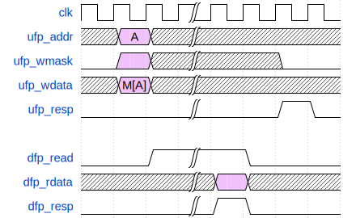 <p
  align="center">Single Write with clean miss timing diagram</p> </p>

<p align="center"> 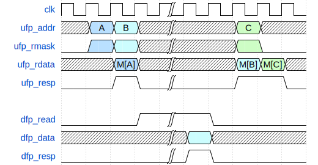 <p
  align="center">Consecutive Read with clean miss timing diagram</p> </p>

<p align="center"> 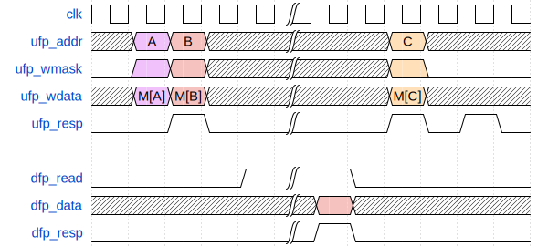 <p
  align="center">Consecutive Write with clean miss timing diagram</p> </p>

## Dirty Misses

<p align="center"> 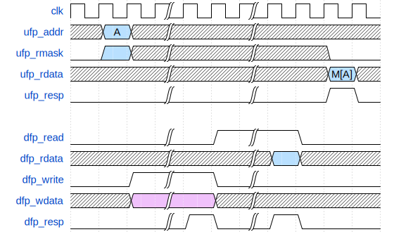 <p
  align="center">Single Read with dirty miss timing diagram</p> </p>

<p align="center"> 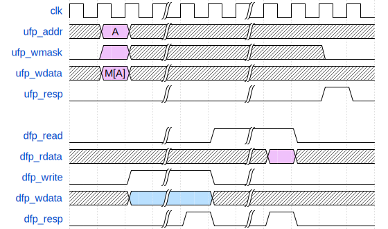 <p
  align="center">Single Write with dirty miss timing diagram</p> </p>

# DFP Memory Behavior

The physical memory that your cache interfaces with has the following
behavior:

<p align="center"> 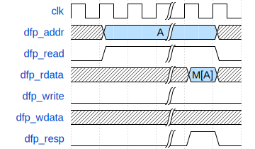 <p
  align="center">Read from physical memory</p> </p>

<p align="center"> 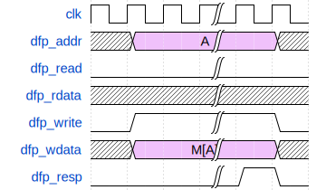 <p
  align="center">Write to physical memory</p> </p>

# SRAM Behavior

[OpenRAM](https://openram.org/) must be used for the data and tag
arrays. After following the steps listed in GUIDE.md, SRAM files can be
found in `sram/outputs/*`. Sample instantiations of these SRAMs are
provided in `hdl/cache.sv`. All other arrays must be implemented using D
flip-flops. OpenRAM provides SRAM models with the following behavior:

<p align="center"> 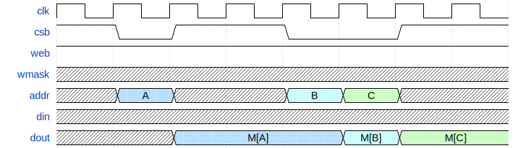 <p
  align="center">Read from SRAM</p> </p>

<p align="center"> 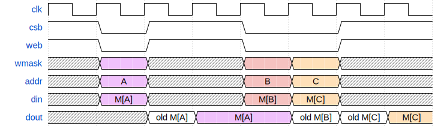 <p
  align="center">Write to SRAM</p> </p>

<p align="center"> 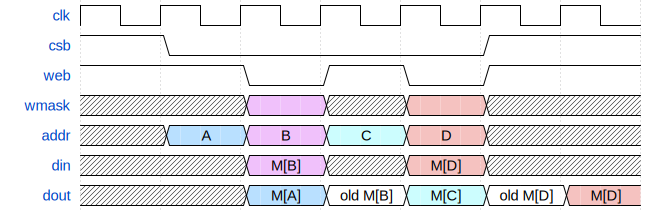 <p
  align="center">Mixed reads and writes to SRAM</p> </p>

<p align="center"> 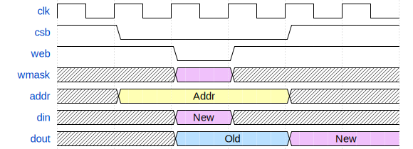 <p
  align="center">Reading and writing to same address for SRAM</p> </p>

# Grading

## Submission
You will be graded on the files on the `main` branch in your class GitHub repository on the specified deadline.

Files you will be graded on:
- `hdl/*.sv`: You are free to modify provided files and add more files in this directory.
- `pkg/types.sv`
- `options.json`

All other files will be replaced by the autograder.

In any graded SystemVerilog file, you must not call non-synthesizable SystemVerilog system tasks.
The string for a system task call (for example, `$display`, `$error`) also must not appear in any
comments. If you would still like to leave references to these functions as comments,
you must remove the '$' preceding the function name to remain eligible for an autograder run.

## Grading

If your design contains any errors from lint/compile/synthesis, your score for the corresponding checkpoint will be a 0.

If your design contains any warnings from lint/compile/synthesis, your score will be multiplied by 0.8.

Failure to satisfy these requirements will result in an exponential deduction on your score:
- Area <= 50,000 μm<sup>2</sup> with half-life of 1,000μm<sup>2</sup>
- Clock period <= 2ns (500MHz clock frequency) with half-life of 0.1ns

Which is to say, your score (before applying warning penalty) will be given by:

$$ \text{raw score} \times 2^{\frac{50,000\mu m^2 - \max(50,000\mu m^2, Area)}{1,000\mu m^2}} \times 2^{\frac{WNS}{0.1 ns}} $$
