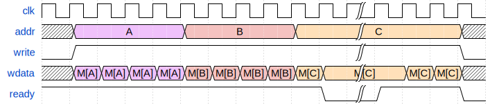
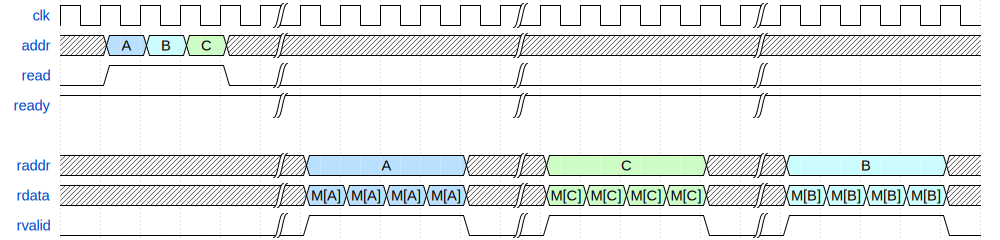

# ECE 411: mp_ooo README

## Out-of-Order RISC-V Processor

> The software programs described in this document are confidential
> and proprietary products of Synopsys Corp. or its licensors. The
> terms and conditions governing the sale and licensing of Synopsys
> products are set forth in written agreements between Synopsys Corp.
> and its customers. No representation or other affirmation of fact
> contained in this publication shall be deemed to be a warranty or
> give rise to any liability of Synopsys Corp. whatsoever. Images of
> software programs in use are assumed to be copyright and may not be
> reproduced.
> 
> This document is for informational and instructional purposes only.
> The ECE 411 teaching staff reserves the right to make changes in
> specifications and other information contained in this publication
> without prior notice, and the reader should, in all cases, consult
> the teaching staff to determine whether any changes have been made.

---

This document, README.md, forms the specification for the machine
problem. For more details and documentation, visit the `docs` folder. Inside, you will find:
- [GUIDE.md](./docs/GUIDE.md) - Some tips and resources for this MP.
- [ADVANCED_FEATURES.md](./docs/ADVANCED_FEATURES.md) - List of advanced features and their associated point values.
- [WHAT_IS_AN_OOO.md](./docs/WHAT_IS_AN_OOO.md) - Basic overview of an OoO processor.
- [TEST_CASES.md](./docs/TEST_CASES.md) - Overview of the released testcases

# Introduction

This machine problem involves the design of an out-of-order microprocessor. You are required to implement the RV32I instruction set (with the exception of FENCE*, ECALL, EBREAK, and CSRR instructions). Furthermore, you will be required to support a subset of the M extension. This handout is an incomplete specification to get you started with your design, as a large portion of this machine problem is left open ended for you to explore design options that interest you.

## Point Breakdown

| Checkpoint  | Points | 
|-------------|--------|
| CP 1        |   20   |
| CP 2        |   15   |
| CP 3        |   15   |
| Competition |   20   |
| Advanced Features | 20 (uncapped) |
| Final Presentation | 10 |

**Total Points:** 100 (not including potential extra credit from advanced features)

# Checkpoints

This MP will be split into 3 mandatory checkpoints.

You are responsible for submitting a progress report and a roadmap for each checkpoint. While these may not seem like many points, they are instrumental in helping you and your mentor TA track your progress, and can help address any issues you may have before they blow up.

Your progress report should mention, at minimum, the following:

- who worked on each part of the design
- the functionalities you implemented
- the testing strategy you used to verify these functionalities
- the timing ~~and energy~~ analysis of your design: fmax ~~& energy~~ report from Design Compiler

You should be both implementing and verifying the design as you progress through the assignment. It will also be useful for you to include an updated datapath with each progress report, as your design will inevitably change as you complete the assignment. Making sure your datapath is up-to-date will help both you and your mentor TA track changes in your design and identify possible issues. Additionally, a complete datapath will be required in your final report.

The roadmap should lay out the plan for the next checkpoint:

- who is going to implement and verify each feature or functionality you must complete
- what are those features or functionalities

It is also useful to think through specific issues you may run into, and have a plan for resolving the issues.

These are not intended to be very long. A single page (single-spaced) will be more than sufficient for both the progress report and the roadmap. Be sure to check with your mentor TA, as they may have other details to include on your progress report and roadmap.

## Checkpoint 1 (20 points)

**Requirements:**
- Draw a design block diagram (using draw.io or similar, **not handwritten!**) of the basic OoO datapath [5]
- Implement a parameterizable queue (depth and width) [5]
- Implement instruction fetch and integrate it with magic memory and your parametrizable queue [7.5]
    - Your program counter should be initialized to `0x60000000`
- Roadmap + Progress Report [2.5]
- Schedule a meeting with your mentor TA to demonstrate the above

## Checkpoint 2 (15 points)

**Requirements:**
- Integrate the provided multiplier into your processor as a functional unit [5]
  - If a single multiply instruction from `ooo_test.s` commits correctly, you get full points.
- Your design must support out-of-order execution of the arithmetic operations (you must implement ROB, RS, CDB, etc.) [5]
  - Correctly runs `dependency_test.s`
  - Instructions writeback to ROB out of order when running `ooo_test.s`.

- Progress report + Roadmap [2.5]
- Schedule a meeting with your mentor TA to demonstrate the above, you will need RVFI integrated to do so
    - RVFI is connected in the same way as mp_pipeline via `hvl/rvfi_reference.json`.

**Multiplier Details:**

- Three multiplication modes are supported and may be selected with the following values applied to the mul_type input
    - `2’b00 = Unsigned * Unsigned `
    - `2’b01 = Signed * Signed`
    - `2’b10 = Signed * Unsigned`

- After the done flag assertion (indicating the last multiplication has finished), the start flag must be reset before another multiplication can be issued i.e. the start flag cannot be held high to issue back to back multiplications
- For signed * unsigned multiplication, the `a` port is for the signed number, and the `b` port is for the unsigned number

## Checkpoint 3 (15 points)

**Requirements:**
- [-5] if any warnings or doesn't pass synthesis.
- Add support for control instructions [3]
  - At minimum: flush everything when a mispredicted branch commits
  - Static-not-taken branch prediction
- Add support for memory instructions [3]
  - At minimum: stall dispatch after a store is dispatched until it is committed
- Integrate with your mp_cache with competition memory (Instruction and Data) [3]
- Should be able to run Coremark [4]
  - If it does not run, write your own testcode to demonstrate the control (taken/not-taken) and memory (load/store) instructions.
- Progress report + Roadmap [2]
- Schedule a meeting with your TA to demonstrate the above. We will run an autograder on your main branch, running coremark.

# Final Submission: Competition + Advanced Features (50)

## Competition (20)

The points awarded for each testcase will be split into two categories: *Correctness* and *Relative Performance Score (RPS)*. **The following points are all tentative**.

Check out [TEST_CASES.md](./docs/TEST_CASES.md) for a list of the currently released test cases. This list may not be final, and we will run some hidden test cases as well.

| Benchmark  | Correctness |    RPS    |
|------------|-------------|-----------|
| Coremark   |   2.5       |    2.5    |
| Benchmark 2|   1         |    4      |
| Benchmark 3|   0.25      |    4.75   |
| etc...     |             |           |

`Performance Score = Power * (Delay^3) * Area^(1/2)`

Power is sampled from running Coremark.

The RPS your team receives is the maximum of the following metrics: 
- Linear based on performance score
- Linear based on leaderboard ranking

**Note:** If you are unable to complete a test case without errors, you will receive 0 points on the performance metric for that test case. This makes correctness the most important metric to meet.

**Note 2:** Your design must synthesize, otherwise you will recieve a 0 for the competition.

## Advanced Features (20)

We also offer points for advanced features. These are processor optimizations, features, or advanced debugging tools that go beyond the baseline requirements. The points for advanced features are *uncapped* - you can earn extra credit by exceeding 20 advanced feature points. 

Here is a document detailing many advanced features and their point values:
[ADVANCED_FEATURES.md](./docs/ADVANCED_FEATURES.md)

Some advanced features require reworking many parts of your design. Therefore, we recommend looking at this list early on in your design process.

## Final Presentation (10)

At the conclusion of the project, you will give a short presentation to the course staff (and fellow students) about your design. In addition, you need to collect your checkpoint progress reports and paper designs together as a final report that documents your accomplishments. More information about both the presentation and report will be released closer to the deadline.

## Group Evaluations

At the end of the project, each group member will submit feedback on how well the group worked together and how each member contributed to the project. The evaluation, along with feedback provided at TA meetings throughout the semester, will be used to judge individual contribution to the project. Up to 30 points may be deducted from a group member's score if it is evident that he or she did not contribute to the project.

Although the group evaluation occurs at the end of the project, this should not be the first time your mentor TA hears about problems that might be occurring. If there are major problems with collaboration, the problems should be reflected in your TA meetings and progress reports. The responses on the group evaluation should not come as a surprise to anyone.

# Memory Models

## Magic Memory

This is the same magic memory model you are familiar with from mp_pipeline. It has a single cycle response time and will be used during checkpoints 1 and 2 of this MP for your processor's instruction fetch stage. It has the following timing characteristics:

  
  
Reads from memory

  
  
Writes to memory

  
  
Mixed reads and writes

## Competition Memory

You will use banked memory for the competition. You ar **required** to use this new memory mode. Unlike previous memory models used throughout the semester, this model supports **multiple outstanding requests**. This means you can send multiple requests before the first response comes back from memory. Furthermore, if you issue multiple read requests, they might come back in a different order than you sent the requests. Writes will **not** be handled out of order.

You are free to use this feature or not at your discretion. It may help performance significantly when paired with other advanced features. If you prefer, you can ignore this feature and use it very similarly to previous memory models which only supported one outstanding request. 

**Make sure to modify generate_memory_file.sh - it should have ADDRESSABILITY=32**

  
  
Single Read Request

  
  
Single Write Request

  
  
Read Queue Full

  
  
Write Queue Full

  
  
Out-Of-Order Read Response

  
  
Mixed Reads and Writes to the Same Destination

## Competition Parameters
For our competition autograder to correctly synthesize and run your processor, we need to know certian things about your cpu. Inside `options.json` there are a few parameters that you will need to set:
- `clock` - Clock period of your processor in picoseconds (ps). Make sure your processor can synthesize at this frequency, otherwise the autograder wont run your code!
- `m_ext` - Denotes whether your processor should run code compiled for the RISC-V M (multiply/divide) extension. Value: true/false.
- `c_ext` - Denotes whether your processor should run code compiled for the RISC-V C (compressed) extension. Value: true/false.
- `f_ext` - Denotes whether your processor should run code compiled for the RISC-V F (floating point) extension. Value: true/false.
- `bmem_0_on_x` - Specifies the value banked memory should return when loading from an uninitialized address. Possibly necessary for various speculative memory execution schemes. `false`: return `X`. `true`: return `0`.

Good Luck! :)
