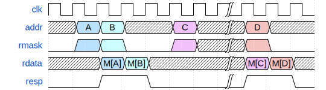

# ECE 411: mp_pipeline README

## Pipelined RV32I Processor

> The software programs described in this document are confidential
> and proprietary products of Synopsys Corp. or its licensors. The
> terms and conditions governing the sale and licensing of Synopsys
> products are set forth in written agreements between Synopsys Corp.
> and its customers. No representation or other affirmation of fact
> contained in this publication shall be deemed to be a warranty or
> give rise to any liability of Synopsys Corp. whatsoever. Images of
> software programs in use are assumed to be copyright and may not be
> reproduced.
> 
> This document is for informational and instructional purposes only.
> The ECE 411 teaching staff reserves the right to make changes in
> specifications and other information contained in this publication
> without prior notice, and the reader should, in all cases, consult
> the teaching staff to determine whether any changes have been made.

---

**This document, README.md, forms the specification for the machine
problem. For a more comprehensive summary, see [GUIDE.md](./GUIDE.md).**

## Design Specifications

  
  
Figure 1: Processor block diagram

You are required to implement a 5-stage pipelined processor that is fully RV32I
compliant with the exception of `FENCE*`, `ECALL`, `EBREAK`, and `CSRR*` instructions.

The specification of the RV32I ISA can be found here:
[The RISC-V Instruction Set Manual](https://riscv.org/wp-content/uploads/2017/05/riscv-spec-v2.2.pdf).
You will implement every instruction listed in Chapter 2 up to and including Section 2.6.
You can also find all the instructions listed in Chapter 19.

Your CPU only needs to support naturally aligned load and stores (described in Section 2.6 of the RISC-V ISA Manual).

Your processor must have all possible hazard resolutions implemented and have no unnecessary stalls. 

Your CPU must only expose two memory ports: one for instruction memory, and one for data memory.
These signals are listed in the provided file `hdl/cpu.sv`.

The two memory ports must have the following timing characteristics:

  
  
Figure 2: Read without stalling

  
  
Figure 3: Write without stalling

  
  
Figure 4: Mixed read and write without stalling

  
  
Figure 5: Read with stalling

  
  
Figure 6: Write with stalling

  
  
Figure 7: Mixed read and write with stalling

Requests made on the two memory interfaces need to be 32-bit aligned.
Memory read and write cannot be simultaneously asserted.

The program counter in your CPU should reset to `0x60000000`.

You are required to connect RVFI to your design. To do so,
put the correct hierarchical reference to the corresponding signal in `hvl/rvfi_reference.json`. 

## Grading

### Submission
You will be graded on the files on the main branch in your class GitHub repository on the specified deadline.

Files you will be graded on:
- `hdl/*.sv`: You are free to add more files in this directory.
- `pkg/types.sv`
- `hvl/rvfi_reference.json`

All other files will be replaced by the autograder.

In any Verilog file, you cannot have non-synthesizable Verilog system tasks, not even in comments.
If you would still like to leave references to these functions as comments,
you must remove the '$' preceding the function name to remain eligible for an autograder run.

Only alpha-numerical characters, `.`, and `_` are allowed inside the 'to be filled out' section in `hvl/rvfi_reference.json`.

### Checkpoints
This MP will be sectioned into 3 checkpoints.  

- **CP1**: You are expected to have all required instructions working,
  with the exclusion of branches, jumps, and memory instructions (loads and stores).
  You are not required to handle pipeline hazards (our test cases will place `nop`s between dependent instructions). The design will also use the ideal next-cycle response memory module
 (`magic_dual_port.sv`) which never stalls. The provided code already has this memory model enabled.
- **CP2**: The remaining instructions (branches, jumps, loads, and stores) are to be implemented in addition to the hazard detection 
  and resolution logic. This includes data forwarding to combat data hazards and flushing the pipeline in the event of control hazards.
  The memory model remains unchanged from CP1.
- **CP3**: You will extend your CPU to work with a more realistic memory model
  that responds in a variable number of cycles (`ordinary_dual_port.sv`). You must swap to the memory model by
  uncommenting it in `hvl/top_tb.sv` and commenting out the `magic_dual_port.sv`.

| Checkpoint | Control Inst | Load & Store | Hazards | Mem. resp Delay |
|------------|--------------|--------------|---------|-----------------|
| CP1        | No           | No           | No      | Next-cycle      |
| CP2        | Yes          | Yes          | Yes     | Next-cycle      |
| CP3        | Yes          | Yes          | Yes     | Variable cycles |

### Points
Points will be assigned for individual instruction functionality, as well as longer tests. The final point breakdown is as follows:

| CP   | Pts |
|------|-----|
| CP1  | 10  |
| CP2  | 15  |
| CP3  | 75  |

For CP1, the point breakdown is as follows:

|     Test        | Pts |
|-----------------|-----|
| Targeted Tests  | 5   |
| Random Testbench| 5   |

For CP2, the point breakdown is as follows:

|     Test        | Pts |
|-----------------|-----|
| Targeted Tests  | 5   |
| Random Testbench| 5   |
| CoreMark        | 5   |

For CP3, the point breakdown is as follows:

|     Test        | Pts |
|-----------------|-----|
| Targeted Tests  | 35  |
| Random Testbench| 20  |
| CoreMark        | 20  |

- **Targeted Tests**: Targeted tests consist of multiple test cases where each aims to test one instruction extensively.
  A detailed breakdown within the targeted tests will be included in the deadline AG report.
- **Random Testbench**: We will run your CPU using our random testbench for a extensive amount of time. This testbench is 
  akin to the constrained random testbench you wrote for part 3 of `mp_verif`, so we recommend utilizing that code!
- **CoreMark**: CoreMark is a microprocessor benchmark program which runs a large set of RV32I instructions.

If your design contains any warnings from lint/compile/synthesis, your score at CP2 and CP3 will be multiplied by 0.9.
SpyGlass lints, DC warnings, and VCS warnings/lints do not result in deductions for CP1.

**Failure to satisfy any of these four requirements will result in a 0 on the entire MP:**
- Area <= 20,000 um2
- Clock frequency >= 500 MHz
- IPC (running long code with no memory and control instructions) >= 0.99
- IPC (using `magic_dual_port.sv` and running CoreMark) >= 0.6
