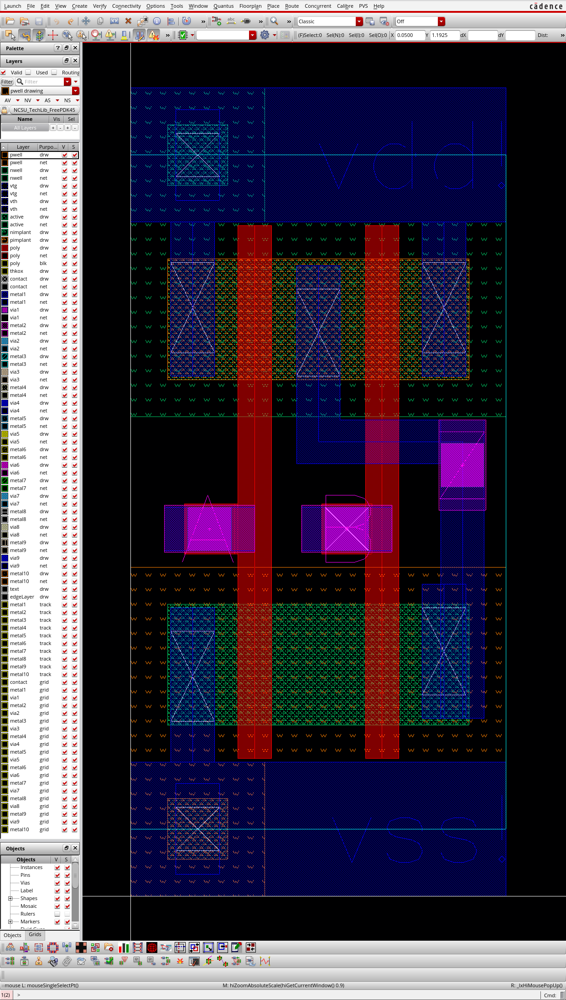

# ECE 425: mp3 GUIDE

**This document, GUIDE.md, serves as a gentle, guided tour of the MP. For strictly the specification and rubric, see [README.md](./README.md).**

## Standard Cell Library

The Design Compiler (DC)(our synthesis tool) and Innovus (our auto PnR tool) needs a standard cell library to work.
The standard cell library is specified using two separate files:
Liberty Timing file (`.lib`) and Library Exchange Format (`.lef`).

### Liberty Timing file

Liberty Timing file, as the name suggests, contains the timing information of your library.
In addition to timing, it also contains the capacitance, power, area, and other useful information.
It also contains the logical function of each cell so that the synthesis tool can map your Verilog to logic cells.
The documentation for this file can be found [here](https://people.eecs.berkeley.edu/~alanmi/publications/other/liberty07_03.pdf),
you do not need to read it all, but it is still a good reference.

To see what a "real" `lib` file looks like, open `/class/ece425/FreePDK45/osu_soc/lib/files/gscl45nm.lib`
with your favorite text editor. (Editor's note: this library is actually not that good.)
If you do not want to package your own standard cell library, you should use this one to complete the rest of the mp.

We have provided a bare minimum `lib` file in this release repo.
In the file, create an entry for every single standard cell you have.
Notably, cell name and pin name should match exactly with the one in your Virtuoso library.
You can optionally fill in the area information.
For the purpose of this class, we do not require you to fill out most of the information in this file.
It is a lot of work to obtain timing for every input transition / output capacitance pair,
or do RC extraction for every pin in your cell. If you're curious for how timing
information is specified, look up `NLDM` (Non-Linear Delay Model).

Synopsys being Synopsys does not accept the plain text `lib` file. It requires you to first compile it to a proprietary format.

In folder with the provided `lc.tcl` and your `stdcells.lib`, run:

```bash
$ lc_shell -batch -f lc.tcl
```

This will output `stdcells.db`, which now Synopsys can use.

### Library Exchange Format

The Library Exchange Format (LEF) file describes part of the layout of your standard cell library. It contains the essence (abstract) of your cells, which is sufficient for the PnR tool.

The `lef` file contains two distinct parts, the technology, and the cells.
The technology `lef` contains information about the manufacturing process we are using. For example: what the vias look like, what the basic DRC rules are, etc.
The cells portion describes the layout of your cells in two parts: The pins, which show the layer and the shapes of the connections, and the blockages/obstructions, which describes metals used inside to make the standard cell work.

A sample `lef` file can be found at `/class/ece425/FreePDK45/osu_soc/lib/files/gscl45nm.lef`.

Before extracting the `lef` of your standard cells, we should mark
the exact boundary of your cells for the extraction tool. In Virtuoso layout:

- Create --> P&R Objects --> P&R Boundary

Draw the box that goes from the left of the middle of the `vdd!` rail to the right of the middle of the `vss!` rail.
It should look something like this (the cyan box):



After doing this for every cell, we are ready to launch the abstract extraction tool.
In the folder where you usually launch Virtuoso, run:

```bash
$ abstract
```

A new (Windows 98 lookin) window should pop up. Inside the window:

- File --> Library --> Open
- Select your standard cell library
- Select all the cells that you want to extract
- Flow --> Abstract
- On the left hand side, click Pin
- In the "Map text labels to pins" field, input the following:
  ```
  (metal1 metal1 metal1)
  (metal2 metal2 metal2)
  ```
  If you have pins on layers other than metal1 and metal2, add them here as well.
- In the "Output pin names" field, write the regular expression that
  will match with any of your output pins. For example,
  `^(Z|Q|QN)$` matches any pin with the name `Z` or `Q` or `QN`
- Click `Run`

You will receive a warning about bus annotation. This is normal.
If there are other warnings, you should fix them before proceeding.

You can now see the abstract view of your cell in Virtuoso.
It should look something like this:


If you have any metal that is not a pin,
they will also show up here as blockage.

After you are done verifying the abstract views of all your cells,
you are ready to export the `lef` file. In the Virtuoso main window (CIW):

- File --> Export --> LEF
- Input location of where you would like the exported `lef` to go
- Select your library
- In the "Output cells" field, select all the cells you want to export
- Leave everything else as default, and click OK

There is a one last step before this is ready to be used.
Open the exported `lef` file and find the "CoreSite" field.
Change "Size" to be `0.005 BY <HEIGHT>`, where `<HEIGHT>` is the height of the P&R Boundary box that you drew earlier. For example:

```
SITE CoreSite
  CLASS CORE ;
  SIZE 0.005 BY 1.69 ;
END CoreSite
```

## Manual for all the tcl stuff

### Man

For both Design Compiler and Innovus,
you can type `man <command>` in their shell and get the corresponding manual
of the command. Say for example, if you type `man compile` in `dc_shell`:
```man
dc_shell> man compile
2.  Synopsys Commands                                        Command Reference
                                    compile

NAME
       compile
              Performs  logic-level  and gate-level synthesis and optimization
              on the current design.

SYNTAX
       status compile
               [-no_map]
               [-map_effort medium | high]
...
```
This should be good reference for almost all of the commands that you will
encounter.

### Cadence Help Center

In Innovus:

- Help --> Documentation Library

This will open up the documentation library.
You will likely find many answers there.

While using the search function, make sure you are searching "Local Documents"
instead of "Cadence Support".

## Synthesis

With the `lib` file (converted to a `db` file),
the synthesis tool is able to synthesize an RTL design using your standard cells.

The provided `synth` folder contains the Makefile and the tcl script to do this.
The provided synthesis script is completed,
except the part where you will import your regfile.
We encourage you to read what it does, using the `man` command
in dc_shell.

For the controller only part, you should use your `controller.sv` from your mp2.

For the entire CPU part, we have provided a newer version of the reference design
that uses DFFs for the register file.

## Auto PnR

After you have the gate level netlist from DC,
you are ready to auto PnR the design!

The skeleton script we provided has certain TODOs in there. You will need to use
the manual and documentation library to complete the script.

To run Innovus, inside the pnr directory:

```bash
$ innovus
```

A new window pops up. The shell for Innovus remains open inside the terminal.

You can copy and paste individual commands from the script into the shell.
Alternatively, you can run the script by running:

```
innovus 1> source pnr.tcl
```

## Integration

### Pins

You need to tailor your design so that it can be integrated
with your datapath. For example, you need to make the PnR tool
put the control signals near where they will connect to the datapath,
so that you don't have to do much routing.

### Importing the PnRed design into Virtuoso

#### Importing GDSII

The provided script exports a `GDSII` file, sometimes also called a stream file.
This file stores the entire layout of your design.

To import it into Virtuoso, in Virtuoso main window:

- File --> Import --> Stream
- Input the steam file location
- Select the library that you want to import the design into
(which contains your standard cells)
- In layer map section, input `/class/ece425/Virtuoso.map`
- Leave everything else default, and click OK.

#### Copying your Virtuoso library

Because of the way our current flow is setup, you have to import the Innovus GDS into a library that contains
all of your standard cells. We recommend making a copy of your standard cell library
inside Virtuoso, into which you will import the `GDSII`. In the library manager:

- Right click on the library that you want to copy
- Copy
- Select "Update Instances of New Copies Only"
- Click OK

## Regfile

Packaging your regfile has almost the same procedure as packaging your standard cells, except this time when you export `lef` you should disable exporting the technology information.

We have provided an almost empty `regfile.lib` that contains the bus notation.
You should complete this file.

To use your custom regfile in synthesis:
First, instantiate your regfile using the name you used in the `lib` file.
Do not supply a Verilog file with the same module name (you need to remove the existing regfile stub).
Then, supply the `lib` file to DC (compiled to `db`),
and DC will be able to link the instance in your Verilog to this marco.
