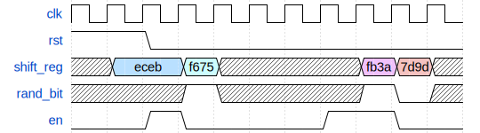
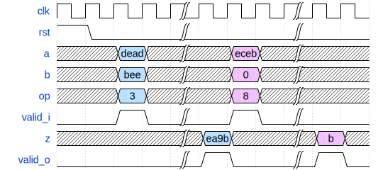

# ECE 411: mp_verif README

## Introduction to SystemVerilog and Verification

> The software programs described in this document are confidential
> and proprietary products of Synopsys Corp. or its licensors. The
> terms and conditions governing the sale and licensing of Synopsys
> products are set forth in written agreements between Synopsys Corp.
> and its customers. No representation or other affirmation of fact
> contained in this publication shall be deemed to be a warranty or
> give rise to any liability of Synopsys Corp. whatsoever. Images of
> software programs in use are assumed to be copyright and may not be
> reproduced.
> 
> This document is for informational and instructional purposes only.
> The ECE 411 teaching staff reserves the right to make changes in
> specifications and other information contained in this publication
> without prior notice, and the reader should, in all cases, consult
> the teaching staff to determine whether any changes have been made.

---

**This document, README.md, forms the specification for the machine
problem. For a more comprehensive summary, see [GUIDE.md](./GUIDE.md).**

# Part 1: SystemVerilog Refresher

Your task is to implement a 16-bit XOR-based Fibonacci linear feedback shift
register (primitive polynomial $x^{16} + x^{14} + x^{13} + x^{11} +
1$) in RTL.

Here is the expected behavior:

You must pass the provided testbench.
You also have to pass synthesis, including timing.

Files that you will be graded on:
- `sv_refresher/hdl/lfsr.sv`

The autograder will replace all other files in `sv_refresher/`.

# Part 2.1: Fixing Common Errors: ALU

You are to fix a given ALU, located at `common_issues/hdl/alu.sv`.
This RTL has numerous bugs and does not meet timing. You should fix all the bugs
(listed in [GUIDE.md](GUIDE.md)) and change the design so that it mets timing.

An incomplete testbench is provided. which you will also need to
complete to verify your ALU implementation.

The operations supported by the ALU are (all unary operations act on
input `a` and ignore input `b`):

| Operation | `op` Code |
| --- | --- |
| Bitwise AND | 0 |
| Bitwise OR  | 1 |
| Bitwise NOT | 2 |
| Add | 3 |
| Subtract | 4 |
| Increment | 5 |
| Left shift | 6 |
| Right shift | 7 |
| Population count | 8 |

Population count is defined as returning the Hamming weight of `a`,
or in other words, how many bits are 1 in the input.

Here is the expected behavior: 

Note that the ALU has no required cycle latency, and is not
required to be pipelined (though you may choose to do so). The ALU is required to meet a clock
frequency of 700MHz.

Files you will be graded on:
- `common_issues/hvl/top_tb.sv`: The autograder will exercise your testbench on
  a reference design to check that your testbench has 100% coverage.
- `common_issues/hdl/alu.sv`: The autograder will run a reference testbench on
  your ALU implementation. Your ALU must also pass synthesis and timing.
  
The autograder will replace all other files in `common_issues/`.

# Part 2.2: Fixing Common Errors: Combinational Loops

The provided design in `comb_loop/hdl` has a combinational loop.
You need to find the loop, fix it, and pass the provided testbench.

Files you will be graded on:
- `comb_loop/hdl/a.sv`
- `comb_loop/hdl/b.sv`

The autograder will replace all other files in `comb_loop/`.

# Part 3: Constrained Random and Coverage

## Specification

You are required to write a set of random constraints in SystemVerilog
to generate valid RISC-V instructions, and implement coverage for this
random testbench. Once finished with both parts, your coverage should
be 100%. In the next part, this constrained random class will be used
to find bugs in an actual RISC-V processor.

To see the list of instructions you need to generate, see Chapter 19
RV32/64G Instruction Set Listings of the [RISC-V 2.2
Specification](https://riscv.org/wp-content/uploads/2017/05/riscv-spec-v2.2.pdf).
The instructions you are required to generate are **all of RV32I, with the
exception of `FENCE*`, `ECALL`, `EBREAK`, and `CSRR*` instructions.**

### Coverpoints

Simple coverpoints that check only certain instruction fields:

- `all_opcodes`: 9 bins. Checks that every opcode is sampled at least once.
- `all_funct7`: 2 bins. There are two possible valid values of `funct7`,
  checks that these occur.
- `all_funct3`: 8 bins. Checks that funct3 takes on all possible values.
- `all_regs_rs1`/`all_regs_rs2`: 32 bins each. Checks that the rs1 and rs2 fields
  across instructions take on all possible values (each register is
  touched).
  
Cross coverpoints:

- `funct3_cross`: 31 bins. Checks that every valid combination of
  `opcode` and `funct3` is sampled. Ignore instructions that do not
  have a `funct3` field, and invalid encodings of `funct3`. Said
  differently, checks that every instruction that uses `funct3` occurs
  at least once.
- `funct7_cross`: 13 bins. Checks that every instruction that uses
  `funct7` occurs at least once.

## Task Details

The constraints must be written in the file `hvl/randinst.svh`. The
covergroup is in the file `hvl/instr_cg.svh`. The files have TODOs
that you must complete to get full credit.

Viewing the coverage reports is highly recommended to debug efficiently.

## Autograder Details

### Random Constraints
To check that you have correctly implemented the random constraints
for generating RISC-V instructions, the autograder will check
that you meet 100.0% coverage on a reference version of the
`instr_cg` covergroup. If you generate any invalid instructions, the
autograder will fail the testcase.

### Coverage
To check that you have correctly implemented coverage, the autograder
checks your coverage report for two sets of stimuli:
- One that does not meet 100.0% coverage.
- One that does meet 100.0% coverage.

Your `instr_cg` covergroup must correctly report the coverage in both
cases.

Files you will be graded on:
- `constr_rand_cov/hvl/randinst.svh`
- `constr_rand_cov/hvl/instr_cg.svh`

The autograder will replace all other files in `constr_rand_cov/`.

# Part 4: Main Verification Task

You are provided a multicycle RISC-V (RV32I) CPU in `main_verif/hdl/`.
This design has numerous functional bugs that you are required to find
by using both random test vectors and by writing assembly (directed
tests). Two verification tools are provided:
- The provided CPU is correctly hooked up to **RVFI** (RISC-V Formal
  Interface), which is a golden non-synthesizable Verilog model of the
  CPU. RVFI executes in parallel to your core by snooping the memory
  bus and register file commit. If there is a mismatch between your CPU's
  commit and RVFI's commit, an error is reported during simulation.
- **Spike** is the official golden *software* model for RISC-V. Spike can
  be run on manually written assembly code, and outputs an
  instruction trace. Your CPU also automatically prints out its own
  instruction trace. These traces must match for any possible input
  program.
  
To get started, copy over `constr_rand_cov/hvl/randinst.svh` and
`constr_rand_cov/hvl/instr_cg.svh` to `main_verif/hvl`. Note that the
constraints for loads and stores in `randinst.svh` must be modified to
maintain the "naturally aligned" constraint. The given CPU *does not
support misaligned loads and stores*.

Files you will be graded on:
- `hdl/*`: The CPU you submit must fix all provided bugs and correctly
  implement the RISC-V spec, with the exception of `FENCE*`, `ECALL`, `EBREAK`, and `CSRR*` instructions.**

The autograder will replace all other files in `main_verif/`.

# Rubric

## Submission
You will be graded on the files in main branch in your class GitHub repository on
the specified deadline.

## Functionality
This MP will be auto-graded out of a total 100 points, assigned to each task as follows.
| Task | Points | 
| --- | --- |
| LFSR | 10 | 
| ALU | 25 | 
| Comb Loop | 5 |
| Constrained Random/Cover Groups | 30 |
| Main Verification Task | 30 |

For all MPs in this course, we will run the autograder on a subset of test cases before the deadline
in order to check compatibility with our system. This is not meant to provide exhaustive
feedback on correctness. The specific testcases used for your final grade will only run after
the final deadline, so you should not rely on the AG for feedback.

## Synthesis
We will also run synthesis on any `hdl` code you submit for this course. Running synthesis
will tell us two important pieces of information:
1. Is your code synthesizable (are you writing realizable hardware)?
2. Do you meet timing constraints, and what is the slack?

In this MP, any designs that do not meet both of these criteria will receive **zero credit**
for that specific subpart.

## Late Policy
Late policies can be found on the course website.
